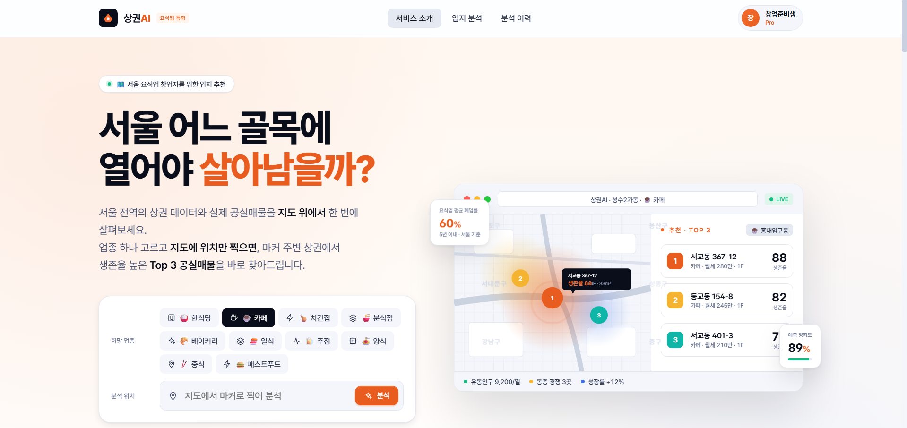

# 서울상권 with AI



서울특별시에서 요식업 독립 창업자를 위한 입지 추천 서비스의 프론트엔드 애플리케이션이다.
지도에서 위치를 지정하면 주변 상권 데이터와 공실매물을 분석하여 생존율이 높은
**Top 3 공실매물**을 추천한다.

## Tech Stack

- React 18 + TypeScript
- Vite (dev server / build)
- React Router v6
- Kakao Maps JS SDK (`react-kakao-maps-sdk` + `kakao.maps.d.ts`)
- localStorage (mock 저장소)

## Getting Started

### Prerequisites

- Node.js 18 이상
- npm 9 이상

### Installation

```bash
npm install
```

### 환경 변수 (Kakao Maps)

`Frontend/.env.local` 파일에 카카오 JavaScript 키를 넣는다 (gitignored).

```
VITE_KAKAO_MAP_KEY=발급받은_javascript_키
```

키 발급은 [developers.kakao.com](https://developers.kakao.com) → 앱 만들기 → **앱 키의 JavaScript 키**.
해당 앱의 **플랫폼 → Web → JavaScript SDK 도메인**에 `http://localhost:5173`,
`http://127.0.0.1:5173` 둘 다 등록해야 로컬에서 SDK가 로드된다.
**제품 설정 → 카카오맵** 토글 ON 도 필수.

### Development

```bash
npm run dev
```

기본 포트는 `5173`이며, 사용 중일 경우 자동으로 `5174`로 할당된다.

### Build / Type Check

```bash
npm run typecheck    # tsc -b
npm run build        # 프로덕션 빌드 (dist/)
npm run preview      # 빌드 결과 로컬 미리보기
```

## Routes

| 경로 | 페이지 | 로그인 필요 |
|---|---|---|
| `/` | 메인 (랜딩) | ✗ |
| `/analyze` | 입지 분석 | ✓ |
| `/history` | 분석 이력 | ✓ |
| `/detail/:id` | 분석 상세 | ✓ |

비로그인 상태에서 보호 라우트로 접근하면 `/`로 리다이렉트되며 로그인 모달이 표시된다.
관련 로직은 `src/auth/ProtectedRoute.tsx`에 정의되어 있다.

## Project Structure

```
src/
├── main.tsx                 - Vite 엔트리 포인트
├── App.tsx                  - 라우트 테이블
├── Layout.tsx               - 공통 chrome (Nav + AuthModal)
├── app/
│   ├── AppRoutes.tsx        - 앱 라우트 구성
│   └── figmaViewMap.ts      - Figma 화면별 route/component/API 매핑
│
├── auth/
│   ├── AuthContext.tsx      - 로그인 상태 전역 컨텍스트
│   └── ProtectedRoute.tsx   - 비로그인 가드
│
├── shared/                  - 공용 컴포넌트
│   ├── Icon.tsx             - SVG 아이콘
│   ├── AuthModal.tsx        - 로그인 / 회원가입 모달
│   ├── Nav.tsx              - 상단 네비게이션 + Footer
│   ├── FactorViz.tsx        - 4종 지표 시각화
│   ├── tokens.css           - 디자인 토큰
│   ├── nav.css / auth.css / factor-viz.css
│
├── pages/
│   ├── Landing/             - 메인 페이지
│   ├── Analyze/             - 입지 분석
│   ├── History/             - 분석 이력 리스트
│   └── Detail/              - 분석 상세 보기
│
├── features/
│   └── analyze/
│       └── model.ts         - 분석 화면 도메인 타입 / 지도 좌표 / fallback data
│
├── data/
│   └── history.ts           - 시드 mock 분석 이력
└── lib/
    └── savedAnalyses.ts     - localStorage CRUD 헬퍼 / 타입
```

## Conventions

- 컴포넌트 파일: PascalCase `.tsx` (예: `Nav.tsx`)
- 헬퍼 / 타입 파일: camelCase `.ts` (예: `savedAnalyses.ts`)
- CSS는 컴포넌트와 동일한 디렉터리에 배치하고 `.tsx`에서 `import './X.css'`로 로드
- 클래스명은 prefix 기반 명명 (`lf-*`, `rr-*`, `dt-*`, `fv-*`)

---

# 팀 분담

- **A · 유저정보 파트** — 페이지 1, 2, 3, 9
- **B · 업종분석 파트** — 페이지 4, 5, 6, 7, 8, 10

## A · 유저정보 파트

### 1. 메인페이지

- `src/pages/Landing/Landing.tsx`
- `src/pages/Landing/Hero.tsx`
- `src/pages/Landing/Sections1.tsx` — `PainPoints`, `Features`
- `src/pages/Landing/Algorithm.tsx`
- `src/pages/Landing/LivePreview.tsx`
- `src/pages/Landing/Sections2.tsx` — `DataSources`, `FinalCTA`
- `src/pages/Landing/landing.css`
- `src/pages/Landing/landing-font-override.css`
- `src/shared/Nav.tsx`의 `Footer`

### 2. 메인페이지 — 로그인 위젯

- `src/shared/Nav.tsx` — `nav-cta` 영역의 로그인 / 회원가입 버튼
- `src/shared/AuthModal.tsx`
- `src/shared/auth.css`
- `src/auth/AuthContext.tsx` — `openAuth`, `closeAuth`, `login`

### 3. 프로필 클릭 시 로그아웃 버튼

- `src/shared/Nav.tsx` — `nav-user` / `nav-user-menu`
- `src/shared/nav.css` — `.nav-user`, `.nav-user-menu`
- `src/auth/AuthContext.tsx` — `logout`

### 9. 분석 이력 페이지

- `src/pages/History/History.tsx`
- `src/pages/History/history.css`
- `src/data/history.ts`
- `src/lib/savedAnalyses.ts` — `readSavedAnalyses`

---

## B · 업종분석 파트

### 4. 상권 분석 — 업종 선택

- `src/pages/Analyze/Analyze.tsx` — `BIZ_TYPES`, `LeftWidget`의 step 1, `lf-biz-grid`
- `src/pages/Analyze/analyze.css` — `.lf-biz-*`

### 5. KAKAO Map 위치 검색

- `src/pages/Analyze/Analyze.tsx` — `MapPickPanel` (kakao.maps.services.Places
  키워드 검색), `handleSearchPan`
- `src/pages/Analyze/analyze.css` — `.lf-mapsearch-*`

### 6. 우클릭으로 위치 지정

- `src/pages/Analyze/Analyze.tsx` — `KakaoCanvas`의 `onRightClick`,
  `handlePickLatLng`, `reverseGeocode` (kakao.maps.services.Geocoder)
- `src/pages/Analyze/analyze.css` — `.kakao-map`, 마커 / 반경 원

### 7. 분석중 위젯 (간소화 / SSE 미사용 / 비동기 처리)

- `src/pages/Analyze/Analyze.tsx` — `runAnalysis`, `LeftWidget`의 `'analyzing'` phase
- `src/pages/Analyze/analyze.css` — `.lf-widget.analyzing`, `.lf-analyzing-ring`

### 8. 분석 결과 / 매물 선택 시 사이드 위젯

- `src/pages/Analyze/Analyze.tsx` — `RightResults`, `PropertyDetail`
- `src/pages/Analyze/analyze.css` — `.rr-*`
- `src/shared/FactorViz.tsx` — `FactorCard`, `buildFactorViz`
- `src/shared/factor-viz.css`
- `src/lib/savedAnalyses.ts` — `writeSavedAnalyses`

### 10. 분석 이력 상세 보기 페이지

- `src/pages/Detail/Detail.tsx`
- `src/pages/Detail/detail.css`
- `src/shared/FactorViz.tsx`, `factor-viz.css`
- `src/lib/savedAnalyses.ts`

---

## 공유 영역

양쪽 파트가 모두 수정할 수 있는 파일이다. 작업 전 알림 후 수정한다.

| 파일 | 수정 사유 |
|---|---|
| `src/App.tsx` | 라우트 추가 / 변경 |
| `src/Layout.tsx` | Nav / Footer 위치 변경 |
| `src/shared/Nav.tsx` | 양쪽 작업이 네비 흐름에 영향을 주는 경우 |
| `src/shared/Icon.tsx` | 새 아이콘 추가 |
| `src/shared/tokens.css` | 디자인 토큰 추가 / 수정 |
| `src/auth/AuthContext.tsx` | A 주관 파일이나 B에서도 `useAuth()`로 read 사용 |
| `src/lib/savedAnalyses.ts` | B에서 write, 양쪽 모두 read |
| `package.json`, `vite.config.ts`, `tsconfig*.json` | 의존성 / 설정 변경 |

---

## 협업 가이드

- `main` 브랜치 직접 push 금지. 모든 변경은 PR로 머지한다.
- 작업 시작 전 `git pull origin main`으로 동기화 후 `git checkout -b feat/xxx`
- 작은 단위로 자주 머지한다.
- PR 본문에는 변경 사항, 변경 이유, 관련 스크린샷을 포함한다.
- 공유 영역 파일을 수정하는 PR의 제목에는 `[shared]` 태그를 부착한다.

### 브랜치 이름

형식: `prefix/내용` (소문자 + 하이픈)

| Prefix | 사용 시점 | 예시 |
|---|---|---|
| `feat/` | 새 기능 개발 | `feat/auth-modal-validation` |
| `fix/` | 버그 수정 | `fix/scroll-locked-on-landing` |
| `refactor/` | 구조 개선 | `refactor/extract-map-component` |
| `style/` | UI / CSS 작업 | `style/landing-hero-spacing` |
| `chore/` | 잡일 (의존성 등) | `chore/upgrade-vite` |
| `docs/` | 문서 작업 | `docs/update-readme` |
| `hotfix/` | 운영 긴급 수정 | `hotfix/login-broken` |

### Commit 메시지

형식: `타입: 한 줄 요약`

| 타입 | 사용 시점 | 예시 |
|---|---|---|
| `feat` | 새 기능 추가 | `feat: 로그인 모달 추가` |
| `fix` | 버그 수정 | `fix: Analyze 페이지 스크롤 잠김 해결` |
| `docs` | 문서 수정 (README 등) | `docs: 팀 분담 표 추가` |
| `style` | 코드 포맷 / 공백 등 동작 변화 없는 변경 | `style: 들여쓰기 통일` |
| `refactor` | 기능 변화 없이 코드 구조 변경 | `refactor: AuthContext 분리` |
| `perf` | 성능 개선 | `perf: 이미지 lazy load 적용` |
| `test` | 테스트 추가 / 수정 | `test: Nav 컴포넌트 테스트 추가` |
| `chore` | 의존성 / 설정 / 빌드 도구 변경 | `chore: vite 5.4로 업그레이드` |
| `ci` | CI 설정 변경 | `ci: GitHub Actions 빌드 스텝 추가` |

---

## Git 워크플로우

파일을 수정해서 원격에 반영하는 한 사이클의 전체 흐름.

### 작업 사이클

```
[main에서 시작]
  ↓ git pull origin main
  ↓ git checkout -b feat/뭐고치는지
[새 브랜치에서 작업]
  ↓ 코드 수정
  ↓ git add → git commit  (필요 시 여러 번 반복)
  ↓ git push
[GitHub UI에서]
  ↓ PR 생성 → 머지
[로컬 정리]
  ↓ git checkout main
  ↓ git pull origin main
  ↓ git branch -d feat/뭐고치는지
```

### 단계별 명령어

#### 1. 작업 시작 — 브랜치 생성

```bash
git checkout main                       # main으로 이동
git pull origin main                    # 원격 최신 내역 받아오기
git checkout -b feat/profile-dropdown   # 새 브랜치 생성 + 이동
```

#### 2. 코드 수정 + commit

```bash
git status                              # 변경된 파일 확인
git add .                               # 또는 git add <파일>
git commit -m "feat: 프로필 드롭다운 추가"
```

같은 브랜치에서 commit은 여러 번 만들 수 있다. 작업 단위마다 쪼개는 것을 권장한다.

#### 3. 원격에 push

```bash
git push -u origin feat/profile-dropdown   # 첫 push (-u 로 upstream 설정)
git push                                   # 같은 브랜치 추가 push는 생략 가능
```

#### 4. PR 생성 + 머지

GitHub UI에서 PR을 생성하고 머지한다. PR 제목은 commit 메시지와 동일한 형식을 사용한다.

#### 5. 머지 후 로컬 정리

```bash
git checkout main
git pull origin main
git branch -d feat/profile-dropdown
```

### 자주 쓰는 명령어

| 명령 | 사용 시점 |
|---|---|
| `git pull origin main` | 작업 시작 전 동기화 |
| `git checkout -b 브랜치명` | 새 브랜치 생성 + 이동 |
| `git status` | 변경된 파일 확인 |
| `git add .` 또는 `git add <파일>` | 변경 사항 staging |
| `git commit -m "타입: 내용"` | commit 생성 (로컬) |
| `git push` | 원격 전송 |
| `git branch -d 브랜치명` | 머지 끝난 로컬 브랜치 삭제 |
